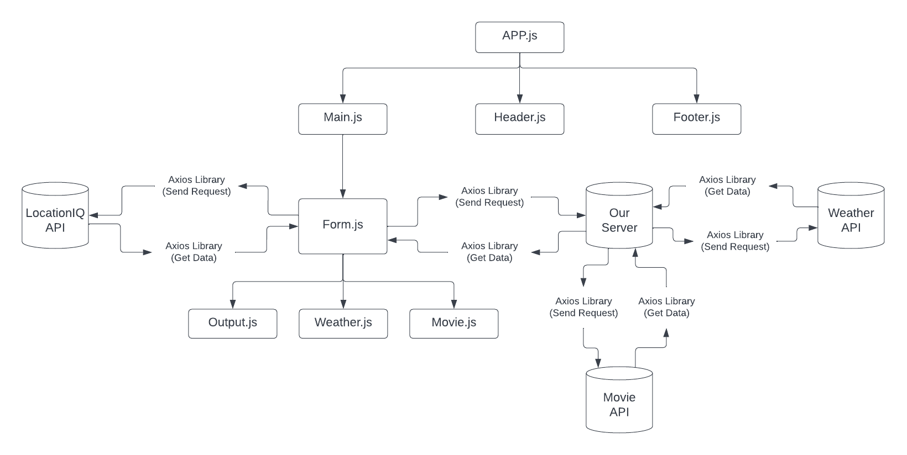

# city-explorer-api

**Author**: Yazan Alfarra
**Version**: 2.0.0

## Overview

Server to fetch data from external APIs.

## Getting Started

1. install the dependencies
2. make routes
3. Initialize response functions

## Architecture

## Change Log

30-08-2022 10:00pm - Application now has a fully-functional express server, capable of fetching data from external APIs.
29-08-2022 2:12am - Application now has a fully-functional express server, with a GET route for the location resource.

## Credit and Collaborations

1. Shoutout to [Ihab Abbas](https://github.com/ihababbas) aka partner. We designed the working methodology and flow of data.

## Time Estimates

**Name of feature :** Express Server

**Estimate of time needed to complete :** 4 hours

**Start time :** 6:00pm

**Finish time :** 10:00pm

**Actual time needed to complete :** 4 hours
