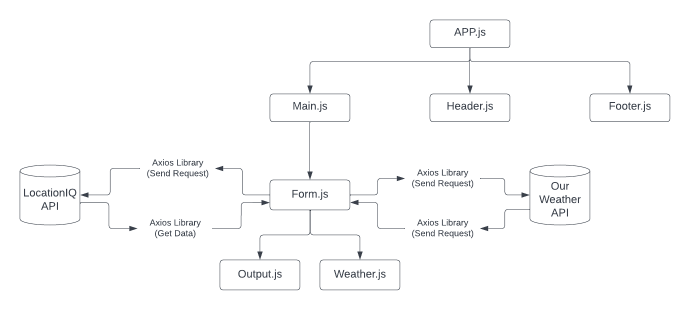

# city-explorer-api

**Author**: Yazan Alfarra
**Version**: 1.0.0

## Overview

It is a custom API contains the data for three cities and their crossponding weather conditions retrieved from old data.

## Getting Started

1. install the dependencies
2. make routes
3. Initialize response functions

## Architecture

## Change Log

29-08-2022 2:12am - Application now has a fully-functional express server, with a GET route for the location resource.

## Credit and Collaborations

1. Shoutout to [Ihab Abbas](https://github.com/ihababbas) aka partner. We designed the working methodology and flow of data.

## Time Estimates

**Name of feature :** Express Server/API

**Estimate of time needed to complete :** 5 hours

**Start time :** 3:00pm

**Finish time :** 2:13am

**Actual time needed to complete :** 11 hours
